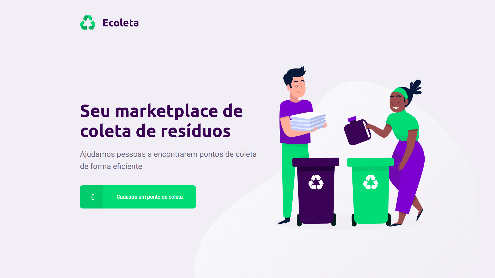
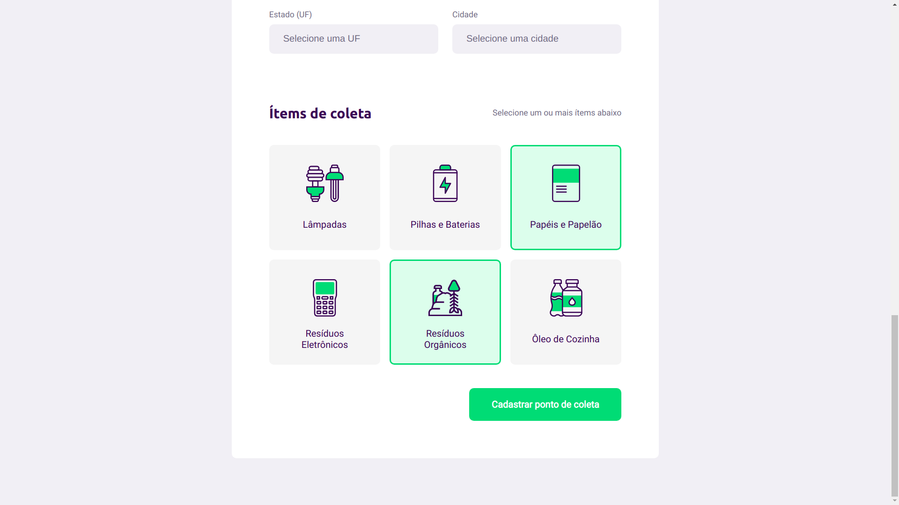
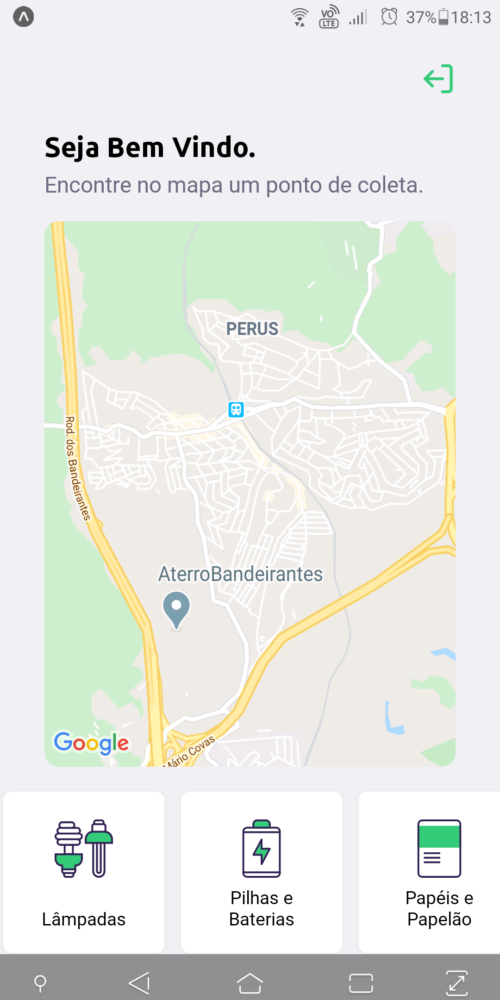
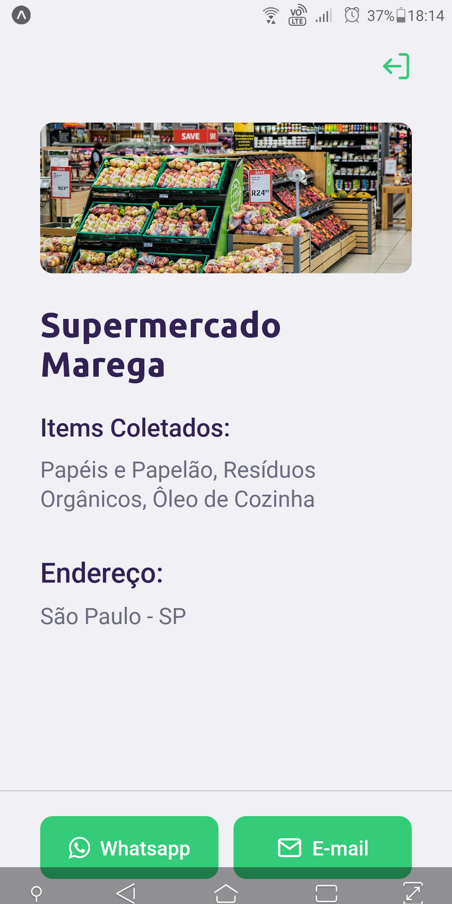

# NLW_Ecoleta
Repositório criado baseado na primeira Edição da Next Level Week
<h4 align="center">

<br><br>
♻️ Seu marketplace de coleta de resíduos ♻️
</h4>
<p align="center">
    
    
    
    
    
</p>

# :bulb: Sobre o projeto 

O projeto **Ecoleta** visa ajudar pessoas que tenham o interesse de descartar resíduos que possam agredir o meio ambiente em locais adequados onde poderam ser reciclados e reaproveitados.
Com ele um estabelecimento pode efetuar um cadastro informando sua localidade e tipos de itens que ele reclica como lâmpadas, óleo de cozinhas, papelão, etc.
Com o aplicativo mobile qualquer pessoa pode buscar por estabelecimentos próximos que faça a coleta dos itens reciclaveis que deseja descartar.
Com isso você ajuda a preservar o nosso planeta reciclando. 🥰

# ⚙️ Como executar


Para executar e testar a aplicação na sua máquina, primeiramente clone o repositório no seu computador.
Após fazer o fork e ter todos os arquivos na sua maquina, siga os seguintes passos:

### Iniciar Servidor

Para instalar todas as dependências do servidor, entre no terminal e execute o seguinte comando:

```bash
$ npm install
```

Com as dependência instaladas e o banco de dados pronto, execute este comando para iniciar o servidor:

```bash
$ npm start
```

### Iniciar App Web

Após iniciar a execução do servidor, inicie a aplicação no terminal executando o comando:

```bash
$ npm start
```


**E pronto, agora você pode usar à vontade toda a aplicação.** :)

# 🧑🏽‍💻 Tecnologias

Segue abaixo uma lista com as principais técnologias utilizados no desenvolvimento desta aplicação.

### ⚛️ Frameworks
- [x] [Node.js](https://nodejs.org/en/) 
- [x] [Express](https://expressjs.com/pt-br/)
- [x] [SQLife](https://www.sqlite.org/index.html)
- [x] [Nunjucks](https://mozilla.github.io/nunjucks/)

### 🏦 Banco de dados
- [x] [MySQL](https://www.mysql.com/)


# :computer: Imagens da Pagina Web

<p align="center">
  
  
  
  
  
  
</p>

# :iphone: Imagens do App Mobile

<p align="center">
  

  

  

  
</p>

 # :tv: Redes Sociais
 Me siga nas minhas redes sociais 😊
 
   <a href="https://github.com/gideonalves" target="_blank" >
    </a> 
  


  <a href="https://www.linkedin.com/in/gideon-alves/" target="_blank" >
    </a>